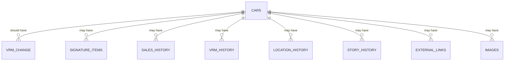

# TT2 - Database

_(Work-in-progress... please feel free to add your own thoughts, suggestions, ideas, etc...)_

This document provides further information as to the data and database schemas that Trophy Tracker 2 utilises. It also details the decisions/reasons/requirements regarding data and management thereof across the TT2 system.

## Database and Tables

SQLite will be used as the backend (BE) database, to store data in a relational model.

### Tables

#### Cars

The Cars table has a row for each vehicle.

| Field               | Type     | Nullable | Description                                                          |
| :------------------ | :------- | :------: | :------------------------------------------------------------------- |
| \_id                | ObjectId | auto     | Id (auto-generated).                                                 |
| vin                 | String   | No       | Vehicle Identification Number (VIN).                                 |
| vrmLastKnown        | String   | no       | The last known Vehicle Registration Mark (VRM/licence plate).        |
| seriesNumber        | Number   | yes      | The supposedly unique car number - 001-500 (UK), 01-50 (SWISS).      |
| createdAt           | Date     | yes      | Entry creation date (in ISO string format).                          |
| updatedAt           | Date     | yes      | Entry updated date (in ISO string format).                           |
| numberOfViews       | Number   | yes      | The number of times that this car has been viewed.                   |
| targetMarket        | String   | yes      | The target market for this car, either "UK" or "SWISS".              |
| registrationDate    | Date     | yes      | Date of registration.                                                |
| insuranceCategory   | String   | yes      | Insurance Category.                                                  |
| vrmOriginal         | String   | yes      | The original Vehicle Registration Mark (VRM/licence plate).          |
| numberOfOwners      | Number   | yes      | Number of owners.                                                    |
| colour              | String   | yes      | The car's main colour (standard is Capsicum Red).                    |
| mileageRecorded     | Number   | yes      | The car's recorded (last known) mileage.                             |
| mileageRecordedDate | Date     | yes      | The date on which the car's recorded (last known) mileage was taken. |
| hasBeenScrapped     | Boolean  | yes      | Whether or not this car has been scrapped.                           |
| scrappedDate        | Date     | yes      | Date on which the car was scrapped.                                  |

#### SignatureItems

The SignatureItems object is used to record the presence of "signature items" for a vehicle. The signature items were items that set the Trophy apart from regular (non-Trophy) versions of the RS Clio. The Boolean type in MongoDB cannot store a null value (only true and false values) hence string values are used ("Y" = Yes, present), ("N" = No, missing), ("U" = Unknown). The notes field is provided for recording signature item specific notes.

| Field                   | Type     | Nullable | Description                                                                 |
| :---------------------- | :------- | :------: | :-------------------------------------------------------------------------- |
| \_id                    | ObjectId | auto     | Id (auto-generated).                                                        |
| vehicleId               | ObjectId | No       | Foreign key back into the Car table                                         |
| hasSachsDampers         | Boolean  | No       | Whether or not the car has the signature Sachs dampers.                     |
| hasRecaroTrendlineSeats | Boolean  | No       | Whether or not the car has the signature Recaro Trendline seats.            |
| hasV6Spoiler            | Boolean  | No       | Whether or not the car has the signature V6 roof spoiler.                   |
| hasTuriniWheels         | Boolean  | No       | Whether or not the car has the signature Trophy-spec Turini alloy wheels.   |
| notes                   | String   | No       | General notes for recording signature item related information for the car. |

#### SaleHistory

The SaleHistoryEntry object is used to record sale (buying/selling) information.

| Field      | Type     | Nullable | Description                          |
| :--------- | :------- | :------: | :----------------------------------- |
| \_id       | ObjectId | auto     | Id (auto-generated).                 |
| vehicleId  | ObjectId | No       | Foreign key back into the Car table  |
| date       | Date     | No       | The date associated with this entry. |
| price      | Number   | No       | Price at time of sale.               |
| mileage    | Number   | No       | Mileage at time of sale.             |
| quality    | Number   | No       | Report quality at time of sale.      |
| typeOfSale | String   | No       | Unnkown/Private/Dealer/Auction.      |
| notes      | String   | No       | General notes of sale.               |

#### VRMChanges

The VRMChange object is used to record changes to the VRM (licence plate).

| Field      | Type     | Nullable | Description                         |
| :--------- | :------- | :------: | :---------------------------------- |
| \_id       | ObjectId | auto     | Id (auto-generated).                |
| vehicleId  | ObjectId | No       | Foreign key back into the Car table |
| changeDate | Date     | yes      | Date of VRM change.                 |
| vrmFrom    | String   | yes      | The 'changing from' VRM.           |
| vrmTo      | String   | yes      | The 'changing to' VRM.              |

#### LocationHistory

The LocationHistoryEntry object is used to record location information - e.g. country of residence, etc. TBC.

| Field     | Type     | Nullable | Description                          |
| :-------- | :------- | :------: | :----------------------------------- |
| \_id      | ObjectId | auto     | Id (auto-generated).                 |
| vehicleId | ObjectId | No       | Foreign key back into the Car table  |
| country   | String   | No       |  |
| region    | String   | No       |  |
| date      | Date     | No       | The date associated with this entry. |

#### StoryHistory

The StoryHistoryEntry object is used to record a story (general update) at a point in time. Multiple stories can exist within a car's story history.

| Field     | Type     | Nullable | Description                                                                        |
| :-------- | :------- | :------: | :--------------------------------------------------------------------------------- |
| \_id      | ObjectId | auto     | Id (auto-generated).                                                               |
| vehicleId | ObjectId | No       | Foreign key back into the Car table                                                |
| date      | Date     | No       | The date associated with this story.                                               |
| content   | String   | No       | The story content. (Restrict to text-only or allow some basic styling, e.g. HTML?) |

#### ExternalLinks

The ExternalLinks object is used to capture links (URLs) to other sites that contain useful information related to a specific car. For example, links to car project threads on car sites, or links to online advertisements.

| Field       | Type     | Nullable | Description                                                 |
| :---------- | :------- | :------: | :---------------------------------------------------------- |
| \_id        | ObjectId | Id (auto-generated).                                        |
| vehicleId   | ObjectId | No       | Foreign key back into the Car table                         |
| title       | String   | No       | A short title for the link.                                 |
| description | String   | No       | A description of what can be found when following the link. |
| url         | String   | Yes      | The website/resource URL.                                   |

## Entity Relationship Diagram (ERD)

